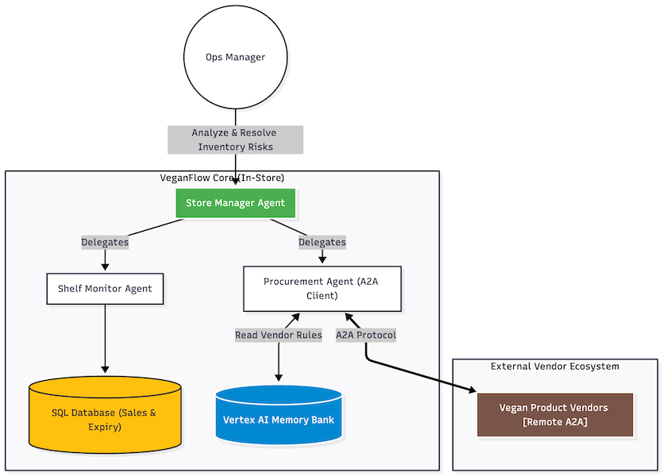

# 🌿 VeganFlow: Autonomous Supply Chain Intelligence

**VeganFlow** is a production-ready Multi-Agent System designed to manage retail supply chains autonomously. Built with the **Google Agent Development Kit (ADK)** and **Gemini models**, it demonstrates advanced agentic capabilities including:

* **Hierarchical Delegation:** An Orchestrator delegating tasks to specialized Inventory and Procurement agents.
* **Agent-to-Agent (A2A) Communication:** Autonomous negotiation with external vendor agents via HTTP protocols.
* **State Management:** Integration with a local SQLite database (`veganflow_store.db`) and long-term memory.
* **Glass-Box Observability:** Detailed tracing of agent thoughts and tool execution.


**Solution Architecture**



---

## 📋 Prerequisites

* **Python 3.11+**
* **Google Cloud Project** (with Vertex AI API enabled)
* **Gemini API Key** (or Vertex AI credentials)
* **Google Cloud SDK (`gcloud`)** installed and authenticated

---

## 🛠️ Installation & Setup

### 1. Clone & Environment Setup
Create a virtual environment to keep dependencies isolated.

```bash
# Create virtual environment
python3 -m venv venv
source venv/bin/activate  # On Windows use: venv\\Scripts\\activate

# Install dependencies
pip install -r requirements.txt
```

## 2. Configuration

Create a `.env` file in the root directory to store your credentials. (Refer to `env.copy` for an example)

**File:** `.env`

```ini
# --- Google AI Config ---
# Set to 1 to use Vertex AI (Production), 0 for AI Studio (Prototyping)
GOOGLE_GENAI_USE_VERTEXAI=1
GOOGLE_API_KEY="YOUR_GEMINI_API_KEY"

# --- Google Cloud Config ---
GOOGLE_CLOUD_PROJECT="YOUR_PROJECT_ID"
GOOGLE_CLOUD_LOCATION="us-central1"

# --- Observability ---
ENABLE_TRACING=true
```

### 3. Initialize the Database

Before running any agents, you must seed the local SQLite database with products and inventory levels.

```bash
python veganflow_ai/tools/retail_database_setup.py
```

*Output: `✅ Database 'veganflow_store.db' rebuilt...`*

## 🏪 Running the Ecosystem (Local Simulation)

To simulate a real-world environment, you must first start the **External Vendor Ecosystem**. These are 11 separate agents running on different local ports (8001-8011) that your main agent will negotiate with.

### 1. Start Vendor Agents

Run the provided shell script to spawn the background processes.

```bash
chmod +x veganflow_ai/external_vendor/run_vendors.sh
./veganflow_ai/external_vendor/run_vendors.sh
```

*Wait for the message: `✅ 11 Vendor Agents are active and listening via A2A.`*

### 2. Run VeganFlow (Choose your interface)

#### Option A: Web UI (Recommended for Demos)

Use Chainlit for a polished, chat-like experience that visualizes the agent's "Chain of Thought."

```bash
chainlit run demo_ui.py -w
```

*Open your browser at `http://localhost:8000`.*

#### Option B: adk web

Run the agent using adk web for debugging.

```bash
adk web
```

#### Option C: CLI Mode

Run the agent directly in your terminal for debugging.

```bash
python main.py
```

## 🧪 Testing & Evaluation

This project includes a systematic evaluation suite to ensure agent reliability before deployment.

### Run CLI Evaluation (`adk eval`)

We use a wrapper package (`eval_wrapper`) to test the agent against a "Golden Dataset" of questions and expected behaviors (e.g., ensuring it delegates correctly).

```bash
# Ensure you are in the root directory
adk eval eval_wrapper orchestrator.evalset.json \\
    --config_file_path=test_config.json \\
    --print_detailed_results
```

**Key Metrics:**

* **`tool_trajectory_avg_score`**: Checks if the agent called the correct tools (e.g., `check_inventory`, `negotiate_with_vendor`).
* **`response_match_score`**: Checks if the text answer matches the expected output.

For more details, please refer to the Jupyter Notebook: `cli_evaluation.ipynb`

### Individual Agent Validation

For individual validation of each agent in the workflow, refer to the following notebooks:
* **`exp_shelf_monitor_agent.ipynb`**: For validating the shelf monitor agent
* **`exp_procurement_agent.ipynb`**: For validating the Procurement Agent
* **`exp_orchestrator_agent.ipynb`**: For validating the entire workflow

## ☁️ Cloud Deployment

You can deploy the core agent logic to **Google Cloud Vertex AI Agent Engine** and the vendor ecosystem to **Cloud Run**.

### 1. Deploy to Vertex AI Agent Engine

Use the ADK CLI to package and ship the `veganflow_ai` module.

```bash
# Make sure your .env has the correct PROJECT_ID
source .env

adk deploy agent_engine \\
  --project="$GOOGLE_CLOUD_PROJECT" \\
  --region="$GOOGLE_CLOUD_LOCATION" \\
  --agent_engine_config_file=veganflow_ai/.agent_engine_config.json \\
  veganflow_ai
```

*Save the `AGENT_ENGINE_ID` from the output.*

### 2. Deploy Vendor Hub to Cloud Run

To make the vendors accessible over the internet (instead of localhost), deploy the vendor hub container.

```bash
gcloud run deploy veganflow-vendors \\
  --source . \\
  --platform managed \\
  --region us-central1 \\
  --allow-unauthenticated \\
  --set-env-vars GOOGLE_CLOUD_PROJECT=$GOOGLE_CLOUD_PROJECT
```

*Save the Cloud Run URL (e.g., `https://veganflow-vendors-xyz.run.app`). You will need to update your database config with this URL for the cloud agents to reach the vendors.*

> **Note:** Refer to Jupyter Notebook `deploy_veganflow_production.ipynb` for a complete deployment example and post-deployment validation.

## 📂 Project Structure

```
├── veganflow_ai/                   # Main Application Package
│   ├── agents/                     # Core Agent Logic
│   │   ├── orchestrator.py         # Root Agent (Router)
│   │   ├── inventory.py            # Shelf Monitor (Database access)
│   │   └── procurement.py          # Negotiator (A2A Client)
│   ├── external_vendor/            # Vendor Simulation
│   │   ├── vendor_agent.py         # A2A Server Logic
│   │   └── run_vendors.sh          # Startup Script
│   ├── tools/                      # Shared Utilities
│   │   ├── retail_database...      # SQLite Setup
│   └── agent.py                    # Cloud Entrypoint
├── eval_wrapper/                   # Evaluation Wrapper Package
├── demo_ui.py                      # Chainlit Web Interface
├── main.py                         # CLI Entrypoint
├── memory_utils.py                 # Long-term memory logic
├── cli_evaluation.ipynb            # CLI Evaluation Notebook
├── exp_shelf_monitor_agent.ipynb   # Shelf Monitor Experiment Notebook
├── exp_procurement_agent.ipynb     # Procurement Agent Experiment Notebook
├── exp_orchestrator_agent.ipynb    # Orchestrator Agent Experiment Notebook
├── deploy_veganflow_production.ipynb # Cloud Deployment Notebook
└── requirements.txt                # Python Dependencies
```

## 🛑 Cleanup

When you are done running locally, remember to kill the background vendor processes to free up ports:

```bash
pkill -f vendor_agent.py
```
